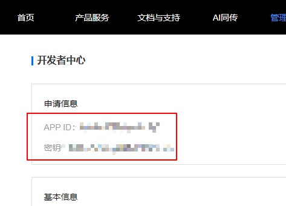
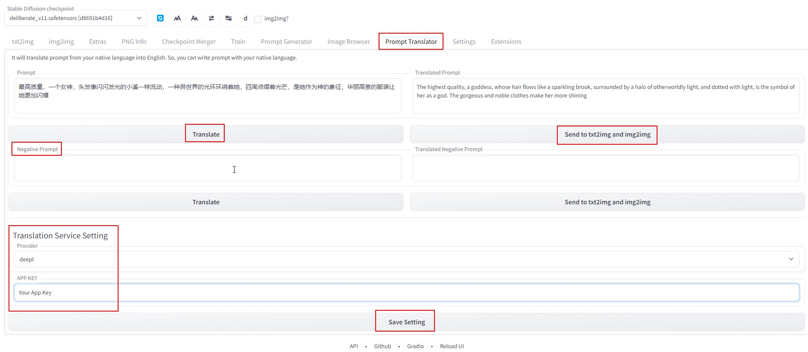
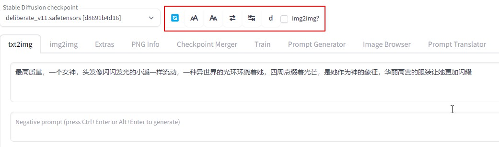
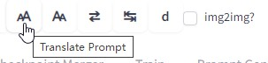
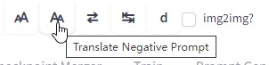
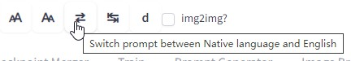
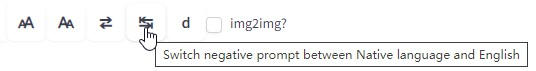
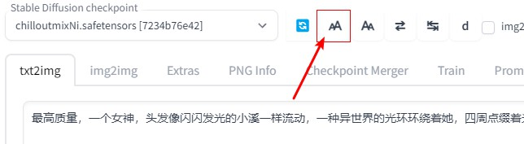
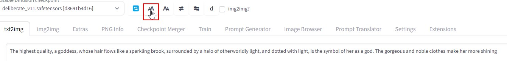
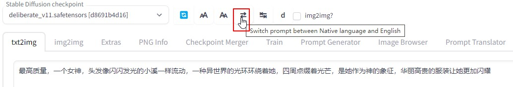

# Stable-Diffusion-Webui-Prompt-Translator
中文名：Stable-Diffusion-Webui关键词翻译插件。

这是Stable-Diffusion-Webui的插件。用于把关键词从你的母语，翻译成英语。这样，从今以后，你就可以用你的母语来写关键词了。

# 安装
下载本项目为 `.zip` 文件。解压放到 `你的Stable-Diffusion-Webui/extensions` 目录。**关闭并重新启动SD webui，光是Reload UI不起作用。**  

# 使用方法
## 设置翻译服务的App Key
这个插件使用在线的AI翻译服务 [Deepl.com](https://www.deepl.com) 或 [Baidu](http://api.fanyi.baidu.com/)的 API 来翻译关键词。  

所以，你需要去他们的网站，申请一个免费API Key。  

免费额度上，deepl每月免费提供50万字符。百度免费提供5万字每月，都够用了。  

对于百度，在[百度翻译API](http://api.fanyi.baidu.com/)网站免费申请。  

**注意，这里不是光申请个帐号就算结束，你要点进去开通"通用文本翻译API"服务。**  

之后，去右上角，你的帐号的“开发者信息”页面，最上面就是:

在插件页面，翻译引擎选百度，填入APP ID 和 APP Key并保存即可。接下来有两种方式使用本插件:

## 在插件Tab界面用

在左边填入关键词，点击翻译，右边就会出现翻译结果。

两边都可以调整，然后，可以点击发送，把翻译的英文，发送到txt2img和img2img的输入框里。

对排除词也一样。  

## 直接在txt2img和img2img页面的工具栏上用  
用顶部工具栏，你可以直接在txt2img/img2img页面翻译关键词，而无需去插件页面。

鼠标移动到工具栏按钮上，会显示功能提示。分别是:
* 翻译关键词  
  
* 翻译排除词  
  
* 在原文和译文之间来回切换。  
  
  
* "d"按钮，是在新标签页打开`Deepl.com`的超链接。万一你不想申请App Key，就用网页版也是可以的。

> 关于工具栏截图上的img2img勾选框：那是老版本用的，相关功能如今已经自动化了，所以这个勾选框已经移除，但懒得重新做截图了。

### 使用流程
比如，我们用中文填入关键词，然后点击翻译按钮。
  
翻译好的英文，会自动回填到输入框，并把原文保存在内存中。  
  

你可以点击切换按钮，在原文和译文之间来回切换。  
  

接下来，你就可以用翻译的英文生成图片。下面就是用翻译的英文生成的图片。  
  

Enjoy!  

# 技巧
## 只翻译一个单词
有时候，我们已经填好了英文的关键词，然后想用母语再添加一个词。

这时候，可以把这个词填写到排除词的地方，翻译之后，再剪切到关键词输入框。   

## API Key的安全性
如果你的App key泄露给了别人，就去Deepl/Baidu，删除那个Key，创建个新的即可。

