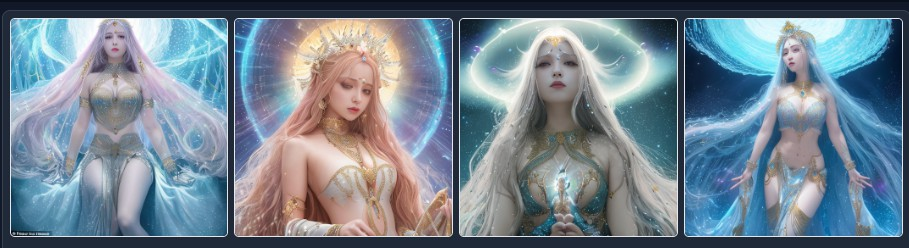

# Stable-Diffusion-Webui-Prompt-Translator
中文名：Stable-Diffusion-Webui关键词翻译插件。

这是Stable-Diffusion-Webui的插件。用于把关键词从你的母语，翻译成英语。这样，从今以后，你就可以用你的母语来写关键词了。

# 使用方法
## 设置翻译服务器的App Key
你需要在插件设置界面上，填入你自己的 deepl.com的API key。你可以免费申请一个，每个月有50万字符的免费额度。和google相比，google翻译质量差很多，还没有每月免费额度。Deepl完爆它一大截。 

如果你在中国，插件也提供百度翻译作为选项。也是要自己申请免费APP Key的。每月也有可观的免费额度。 

填入APP Key并保存后，有2种方式使用本插件:

## 在插件Tab界面用

在左边填入关键词，点击翻译，右边就会出现翻译结果。

你可以调整关键词，并再次翻译。最后，点击发送按钮，把翻译的英文，发送到txt2img和img2img的输入框里。

对排除词也可以翻译。  

## 直接在txt2img和img2img页面工具栏上用  

鼠标移动到工具栏按钮上，会显示功能提示。分别是:
* 翻译关键词  
  
* 翻译排除词  
  
* 在原文和译文之间来回切换。  
  
  
* "d"按钮，是在新标签页打开`Deepl.com`的超链接。万一你不想申请App Key，就用网页也是可以的。

比如，我们用中文填入关键词，然后点击翻译按钮。翻译好的英文，会自动回填到输入框，并把原文保存在内存中。  
  

现在，你就能点击切换按钮，在原文和译文之间，随意来回切换了。  
  

接下来，你就可以用翻译的英文生成图片。下面就是用翻译的英文，生成的第一组图片。关键词的中英文，上图都提供了。  
  

为避免走光风险，图片就不放大了。但即使是小图，也能感觉到质量不错。

如果你要去img2img页面，一定要勾选工具栏上的勾选框。因为没有API来告诉扩展当前哪个Tab是激活的，所以只能这样手动点选一下。回到txt2img再取消勾选。

  

Enjoy!  

# 常见问题
## App Key
Deepl只需要App Key。百度需要App ID和APP Key，都在开发者信息面部上。你两个都要填入设置中。填完后必须保存。  

如果你的App Key泄露出去了，你可以去Deepl或百度网站，删除那个Key，再生成个新的。   

## 文本框必须编辑过
SD webui使用一个叫gradio的库来生成UI。这个gradio问题一大堆，限制也是一大堆。如果你没有修改过关键词，只是反复点翻译，那么，虽然还是能翻译，但不会再把翻译结果回填回来。 

要让翻译的关键词正常回填回来，你最少要敲个空格之类的，来触发“输入” 的事件。

