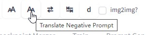
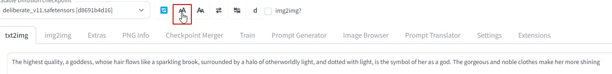

### Language
[中文](README.cn.md)

# Stable-Diffusion-Webui-Prompt-Translator
This Stable-Diffusion-Webui's extension can translate prompt from your native language into English, so from now on, you can write prompt with your native language.

# How to use
## Set translation API Key
You need to fill your own deepl.com's API key. you can apply one for free, with 500,000 character/month for free. Compare to google translator,  google translator comes with way much worse quality without any free words/month. Deepl beats it in every way. 

If you are in China, it offers Baidu translation as a choice too. You need to apply your own APP Key for free too. 

After save your APP Key, there are 2 ways to use it:

## On its extension tab

You fill prompt at left, click translate button, AI translated English will be at right side.  

Then you can adujust your prompt and translate again. At last, send translated English prompt to txt2img and img2img tab's prompt area.  

Works on negative prompt too.  

## With toolbar on txt2img and img2img tabs  

Move your mouse onto those buttons on toolbar, it will show a tooltip. They are:
* Translate Prompt  
  
* Translate Negative Prompt  
  
* Switch between your native language and translated English  
  
  
* The "d" button is a link to open Deepl.com in a new tab. In case you don't want to apply an APP Key, you still can use it at its website.

For example,  we fill prompt with asian language, then click "translate button". it will fill the translated English into prompt textbox, and save your native language prompt in memory.  
  

Now, you can click switch button to switch between your native language prompt and translated English as you wish.  
  

Then you can use the translated English for generating. Following is the first group of pictures generated with translated English. Both this prompt is showed above in both languages.  
  

To avoid NSWF issue, I won't upscale them. But you can feel the quality is pretty good.  

If you go to img2img, remember to check the check box on toolbar. Because there is no API for this extension to know which tab is active. So you have to tell it in this way. Also uncheck it when you come back to txt2img.m  

  

Enjoy!  

# Common Issue
## App Key
Deepl only need an App Key. Baidu offers an app id and an app key, you need to fill them both. And you have to save your setting.   

If your App key is leaked to other people, you can go to Deepl/Baidu, delete this key and create a new one.    

## Text box must be edit.
SD webui uses a library called gradio for UI page. This gradio has a lot of issues and limits. If you do not modify your prompt, just keeps clicking "translate button" again and again, it will translate your prompt, but won't fill translated English back anymore. 

To make it can fill translated prompt back, you need to at least input a " " to trigger a "input" event.  
