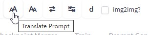
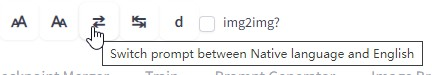
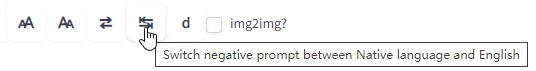
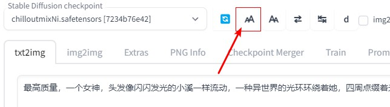
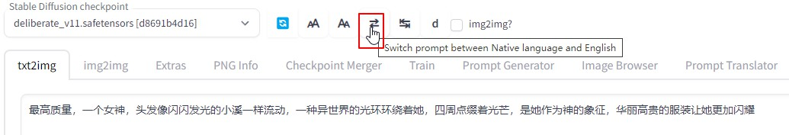

### Language
[中文](README.cn.md)

# Stable-Diffusion-Webui-Prompt-Translator
This Stable-Diffusion-Webui's extension can translate prompt from your native language into English, so from now on, you can write prompt with your native language.

# Install
GO to SD webui's extension page, choose install from github url. Fill it with this project's url, click install.

(If you can not connect to github, you can just download this project as `.zip` file. Unzip it to `Your Stable-Diffusion-Webui/extensions` folder.)

**Then, Re-Launch Stable-Diffusion-Webui, Just reload UI won't work.**  

# How to use
## Set translation API Key
This extension uses Online AI translator service [Deepl.com](https://www.deepl.com), [Google](https://cloud.google.com/translate/docs/setup?hl=en), [Yandex](https://yandex.com/dev/translate/) and [Baidu](http://api.fanyi.baidu.com/)(for Chinese)'s API to translate your pormpt.  

Or, use local AI translation engine [MarianMT](https://huggingface.co/docs/transformers/model_doc/marian)  

For online service, you need go to those translation website, apply a free API Key for this. Fill your API Key to this extension's tab page, click save, done.  

(For baidu, check [README.cn.md](README.cn.md))  

For local AI translation engine MarianMT, you need to do a lot of downloading work, and the quality is not as good as online service. It also need to load a model when using. But if you still want it, check [Setup for MarianMT](#setup-for-marianmt) section.   

### Setup for Deepl
With deepl, it offers you 500,000 character/month for free. That's more than enough.  

After applying the API, go to your acount, the API key is at the bottom like following:
  


After you get your APP Key, fill it into this extension's tab page, then click save. 

### Setup for Yandex
On Yandex's translation API service's page:   
[https://yandex.com/dev/translate/](https://yandex.com/dev/translate/)  
There is a button for "Get Free API Key" at Step 3.   

Do that to get your APP ID and APP Key, then fill them into this extension.  

With Yandex, APP ID is called `Folder ID`, APP Key is called `IAM token`.  

I don't know the detail for using Yandex. I don't use yandex. The code for yandex is provided by pull request and the code looks good so I merged it. But no document for that. You need to try it yourself.    

### Setup for Google translation API Key [check](https://cloud.google.com/translate/docs/setup?hl=en)
**Note: Google API does not offer any free words per month, and setup is kind of complex for normal user. Only choose google when you can not use other service.**  


1. create GCP project([check](https://cloud.google.com/resource-manager/docs/creating-managing-projects?hl=en))
2. enable "Cloud Translation API" 
    - search "translation" 
    - click "Cloud Translation API"
    - click "ENABLE"
3. create "API Key"
    - after "Cloud Translation API" click "MANAGE"
    - select PROEJCT, and godo "API/Service Details" 
    - click "CREDENTIALS" tab and click "CREATED CREDENTIALS"


If you are in China, just choose [Baidu](http://api.fanyi.baidu.com/).   


### Setup for MarianMT
[MarianMT](https://huggingface.co/docs/transformers/model_doc/marian) is an open source local AI translation engine. But the quality is not as good as online translation services.  

To use it, you need do following things:  
Go to extension folder, create a "MarianMT" Subfolder.  

#### Download MarianMT Model
Go to [MarianMT's model page](https://huggingface.co/Helsinki-NLP). There are 1000+ models in the list.  

Each model is target on a Source languge to a Target languge task.  

For example, model `opus-mt-en-ja` means this model can translate English to Japanese. And `opus-mt-ja-en` means it can translate Japanese to English.  

So, you need 2 models for your native language.  

Go to a model's project page, you will find, each model is a folder, not just 1 file.  

To download it, you need use command line window, which is cmd in windows. Go to extension's `MarianMT` subfolder, which you just created. Run following command:  
```
git clone This_Model_Project's_URL
```
For example, for model `opus-mt-ja-en`, it will be:  
```
git clone https://huggingface.co/Helsinki-NLP/opus-mt-ja-en
```

This git clone, will download all small files and ignore large model files.   
(We don't use `git lfs` command here, since we only need 1 of those large model files)  

Now, go to this model project's file list, click and download the file `pytorch_model.bin` manually. Then put it into `this_extension_folder/MarianMT/this_model's_folder`. 

Now, this model is fully downloaded. And this whole model folder, will be loaded as a model.  

You need to download `Your_language-en` and `en-Your_language` models for your language.   

**After downloading these 2 models**, reload SD webui, go to extension's tab. Choose `MarianMT` as provider. 

Now, you can start to translate. Just leave App Key empty, it is not needed in this case.  

FYI, when you changing target language from the dropdown list, extension will load the model for that, so it gonna take a few seconds.  

#### Limited Support for MarianMT
This extension only has limited support for it. And No feature request will be accept about MarianMT.    


**Now, you have 2 ways to translate your prompt:**

## Use extension tab


You fill prompt at left side, click translate button, Translated English will be filled to right side.  

You can adujust both of them, then click "Send" button, to send translated English prompt to txt2img and img2img page's prompt.  

Works on negative prompt too.  

## Use the toolbar in txt2img/img2img page
With this toolbar, you can directly translate prompt in txt2img/img2img page, without going to extension page.

Move your mouse onto those buttons, they will show tooltips. Like following:
* Translate Prompt  
  
* Translate Negative Prompt  
  
* Switch prompt between your native language and translated English  
  
  
* The "**d**" button is a link to open [Deepl.com](https://www.deepl.com) in a new tab. In case you don't want to apply an APP Key, you still can use it on its website.

> About img2img checkbox on toolbar's screenshot: It is for old version, now we can check it automatically so it is not needed anymore. 

### Usecase
For example,  we filled prompt with asian language, then click "Translate" button. 
  

It will translate your prompt then fill translated words back. And save your native language prompt into memory.  
  

You can click switch button to switch between your native language prompt and translated English as you wish.  
  

Now, you can use the translated English for generating. 

Following is generated images with AI translated English.
  


Enjoy!  

# Tip
## Translate one word
Sometime, we've already set prompt in English, then just want to add one word with native language.  

In that case, we can fill that word into negative prompt, translate it, then cut&paste it back to prompt.   

## Security of API Key
If your App key is leaked to other people, you can go to Deepl/Baidu, delete that key and create a new one.    

